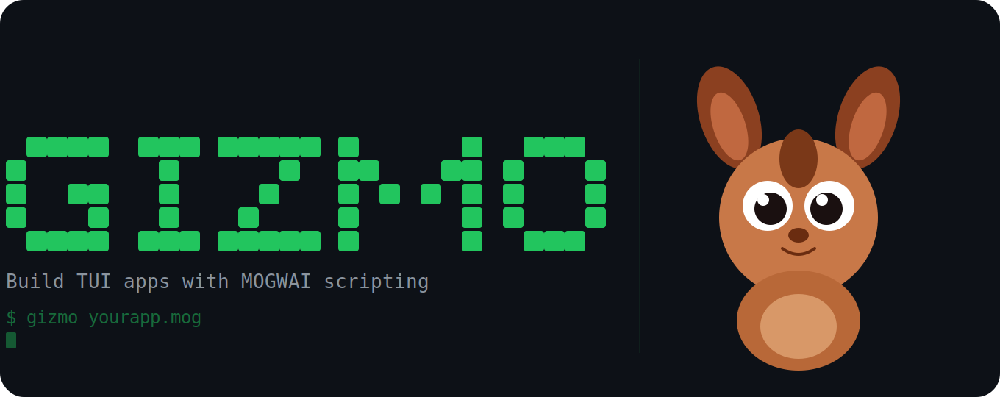
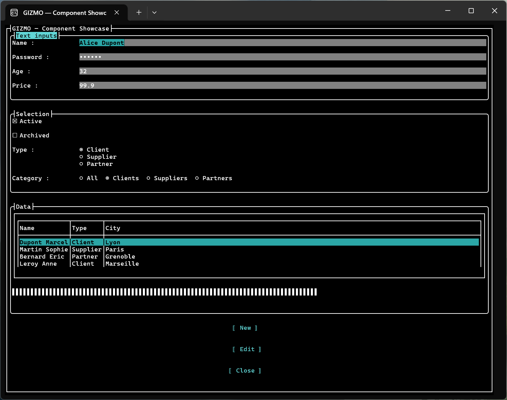

# GIZMO

**Build Terminal User Interface applications with MOGWAI scripting**




[](https://gizmo.mogwai.eu.com)

---

## What is GIZMO?

GIZMO is a standalone console application that lets you build **fully interactive TUI (Terminal User Interface) applications** using [MOGWAI](https://github.com/Sydney680928/mogwai), a stack-based RPN scripting language inspired by HP RPL calculators.

You write a `.mog` script that describes your interface declaratively — windows, buttons, inputs, lists, tables — and GIZMO renders it as a live TUI application powered by [Terminal.Gui v2](https://github.com/gui-cs/Terminal.Gui).

No C#. No compilation. Just a script and `gizmo yourapp.mog`.

---

## Preview



*Component showcase running in Windows Terminal with the built-in dark theme.*

---

## Why GIZMO?

- **Runs anywhere** — from Windows desktop to Raspberry Pi, the same `.mog` script runs on all platforms without modification
- **No .NET required** — distributed as a self-contained executable
- **Declarative UI** — describe your interface as MOGWAI records
- **Live scripting** — timers, events, and dynamic updates work out of the box
- **Lightweight tooling** — a text editor is all you need to get started

---

## Blog Articles

A curated list of English articles about GIZMO on [coding4phone.com](https://coding4phone.com):

- [GIZMO — Build TUI Applications with MOGWAI](https://coding4phone.com/?p=2479&lang=en)
- [Evaluating a user-defined mathematical formula with GIZMO and MOGWAI](https://coding4phone.com/?p=2518&lang=en)

---

## Quick start

### 1. Download GIZMO

Download the latest release for your platform from the [Releases](../../releases) page:

| Platform | File |
|---|---|
| Windows x64 | `gizmo-win-x64.zip` |
| macOS x64 (Intel) | `gizmo-osx-x64.tar.gz` |
| macOS arm64 (Apple Silicon) | `gizmo-osx-arm64.tar.gz` |
| Linux x64 | `gizmo-linux-x64.tar.gz` |
| Linux arm64 | `gizmo-linux-arm64.tar.gz` |

Extract the archive for your platform:

```bash
# Windows
# Unzip with File Explorer or: Expand-Archive gizmo-win-x64.zip

# macOS / Linux
tar xzf gizmo-osx-arm64.tar.gz   # adapt to your platform's filename
```

The Linux/macOS executable is already marked executable after extraction — no `chmod +x` needed.

### 2. Write your first app

Create a file `hello.mog`:

```mogwai
[
    name: 'main'
    title: "My first GIZMO app"

    childs:
    (
        [ui.kind: 'ui.label' name: 'clock' text: "00:00:00"]

        [ui.kind: 'ui.edit' name: 'txtName' label: "Your name:" text: ""]

        [
            ui.kind: 'ui.button'
            label: "Say hello"
            onClick:
            {
                [name: 'txtName'] ui.gprop -> '$r'
                "Hello, {! $r text: get} !" eval -> '$msg'
                [! ui.kind: 'ui.info' title: "Hello" text: @msg] msgbox.show
                drop
            }
        ]

        [ui.kind: 'ui.button' label: "Quit" onClick: { false window.hide }]
    )
]

window.show -> 'r'
```

### 3. Run it

```bash
gizmo hello.mog
```

---

## UI Components

| Component | Description |
|---|---|
| `ui.label` | Static text |
| `ui.edit` | Single-line text input |
| `ui.password` | Password input (masked) |
| `ui.multiline` | Multi-line text area |
| `ui.integer` | Integer input |
| `ui.float` | Floating-point input |
| `ui.check` | Checkbox |
| `ui.radio` | Radio button group |
| `ui.combo` | Dropdown list |
| `ui.button` | Clickable button |
| `ui.listview` | Scrollable list |
| `ui.tableview` | Multi-column table |
| `ui.progress` | Progress bar |
| `ui.frame` | Bordered container with title |
| `ui.separator` | Horizontal line |

---

## Events

Components react to user interactions through named event handlers.  
Use either `{ }` (standard braces) or `« »` (MOGWAI function literals):

| Event | Components | Trigger |
|---|---|---|
| `onClick:` | `ui.button` | Button clicked or Enter pressed |
| `onChange:` | `ui.edit`, `ui.password`, `ui.integer`, `ui.float`, `ui.multiline`, `ui.check`, `ui.radio`, `ui.combo` | Value changed |
| `onValidate:` | `ui.edit`, `ui.password`, `ui.integer`, `ui.float` | Enter pressed to confirm |
| `onSelect:` | `ui.listview`, `ui.tableview` | Selection changed |
| `onActivate:` | `ui.listview`, `ui.tableview` | Item activated (Enter / double-click) |

```mogwai
[
    ui.kind: 'ui.edit'
    name: 'search'
    label: "Search:"
    onChange:  { ui.eventData text: get debug.write }
    onValidate: { "Searching..." debug.write }
]
```

---

## Window navigation

`window.show` opens a window and blocks until it is closed.  
`window.hide` closes the current window and passes a status value back.

```mogwai
# Window 1
[
    name: 'menu'
    title: "Main menu"
    childs:
    (
        [ui.kind: 'ui.button' label: "Open settings" onClick: { 'settings' window.hide }]
        [ui.kind: 'ui.button' label: "Quit"          onClick: { false       window.hide }]
    )
]
window.show -> '$r'

# $r = [window: 'menu' status: 'settings'] or [window: 'menu' status: false]

if ($r status: get 'settings' ==) then
{
    [name: 'settings' title: "Settings" childs: (...)]
    window.show drop
}
```

Only one window can be active at a time. `window.show` returns an error (MW.7) if called while a window is already running.

---

## Timers and dynamic updates

MOGWAI timers run continuously and can update the UI at any time:

```mogwai
timer 'clock' every 1000 do
{
    if (window.current 'main' ==) then
    {
        now ->date -> '$h'
        "{! $h hour: get}:{! $h minute: get}:{! $h second: get}" eval -> '$time'
        [! name: 'lblClock' text: @$time] window.update
    }
}

[name: 'main' title: "Clock" childs: (
    [ui.kind: 'ui.label' name: 'lblClock' text: "00:00:00"]
    [ui.kind: 'ui.button' label: "Quit" onClick: { false window.hide }]
)]

'clock' timer.start
window.show drop
```

---

## Primitives reference

| Primitive | Description |
|---|---|
| `window.show` | Show a window (blocking). Pushes `[window: 'name' status: value]` when closed. |
| `window.hide` | Close the current window. Takes one mandatory value as status. |
| `window.update` | Update a component property at runtime. |
| `window.active` | Pushes `true` if a window is currently displayed. |
| `window.current` | Pushes the name of the active window. |
| `dialog.show` | Show a modal dialog. Pushes a result record with field values. |
| `msgbox.show` | Show an info or confirm message box. |
| `filedialog.show` | Show an open/save/folder file dialog. |
| `ui.gprop` | Get properties of a named component. |
| `ui.sprop` | Set properties of a named component. |
| `run` | Load and execute a `.mog` script file. |

---

## Tooling

### VS Code + MOGWAI extension

The recommended way to write GIZMO scripts is **VS Code** with the **MOGWAI language extension**:

- Syntax highlighting for `.mog` files
- Code completion
- Inline error reporting
- **Full debug support** — step through your script, inspect the stack and variables

> The MOGWAI VS Code extension is the best developer experience for GIZMO today.  
> MOGWAI Studio (a dedicated IDE) will be available in a future release.

### Interactive REPL

Run `gizmo` without arguments to enter interactive mode:

```
gizmo
```

Type MOGWAI expressions directly, load scripts with `run`, or open the built-in code editor with `edit`.

| Command | Description |
|---|---|
| `edit` | Open the built-in TUI code editor |
| `studio` | Connect to MOGWAI Studio or the VS Code extension |
| `help` | Show usage instructions |
| `about` | Show version information |
| `bye` | Exit GIZMO |

---

## MOGWAI language

GIZMO uses **MOGWAI** as its scripting engine. MOGWAI is a stack-based RPN language inspired by HP RPL calculators (HP 28S, HP 48).

- 📖 [MOGWAI documentation and source](https://github.com/Sydney680928/mogwai)
- ✍️ [Articles and tutorials on coding4phone.com](https://coding4phone.com)
- 🌐 [MOGWAI website](https://mogwai.eu.com)

---

## Building from source

Requirements: .NET 10 SDK

```bash
git clone https://github.com/Sydney680928/Gizmo
cd Gizmo
dotnet build
```

Self-contained publish:

```bash
dotnet publish -c Release -r win-x64 --self-contained
dotnet publish -c Release -r osx-x64 --self-contained
dotnet publish -c Release -r osx-arm64 --self-contained
dotnet publish -c Release -r linux-x64 --self-contained
dotnet publish -c Release -r linux-arm64 --self-contained
```

---

## Roadmap

- [x] Core UI components (label, edit, button, list, table, combo, progress, frame…)
- [x] Events: onClick, onChange, onValidate, onSelect, onActivate
- [x] Timers and dynamic UI updates
- [x] Modal dialogs, message boxes, file dialogs
- [x] Window navigation (show / hide)
- [ ] Component color customization
- [x] Built-in script editor — `edit` command opens a full-screen TUI editor
- [ ] MOGWAI Studio integration

---

## Changelog

See [CHANGELOG.md](CHANGELOG.md) for the full history of changes.

---

## License

Apache 2.0 — see [LICENSE](LICENSE)

---

## Author

Created by **Stéphane Sibué** — the creator of MOGWAI.

> GIZMO is named after the friendly Mogwai from *Gremlins* (1984).  
> Just like Gizmo, it's the approachable, helpful face of something powerful underneath.
